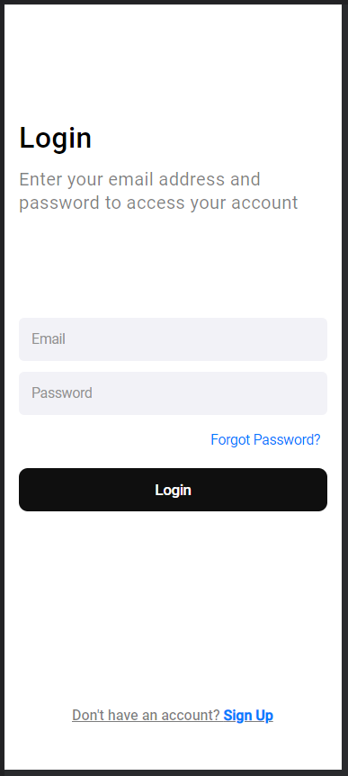

# Desafio Figma com CSS Mobile  

> Resultado do Desafio Figma 

### Ajustes e melhorias

O projeto ainda está em desenvolvimento e as próximas atualizações serão voltadas nas seguintes tarefas:

- [x] Estrutura HTML 
- [x] Estilização com CSS
- [ ] Atualizar o layout 

## 🤝 Colaboradores

Agradecemos às seguintes pessoas que contribuíram para este projeto:

<table>
  <tr>
    <td align="center">
      <a href="https://www.linkedin.com/in/elioenai-oliveira-costa-ancelmo">
         
        
          <b>Elioenai Ancelmo</b>
        
      </a>
    </td>
</table>

